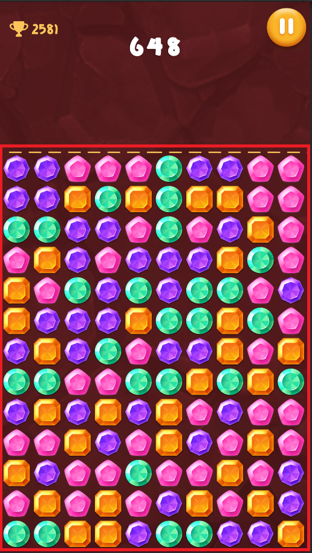
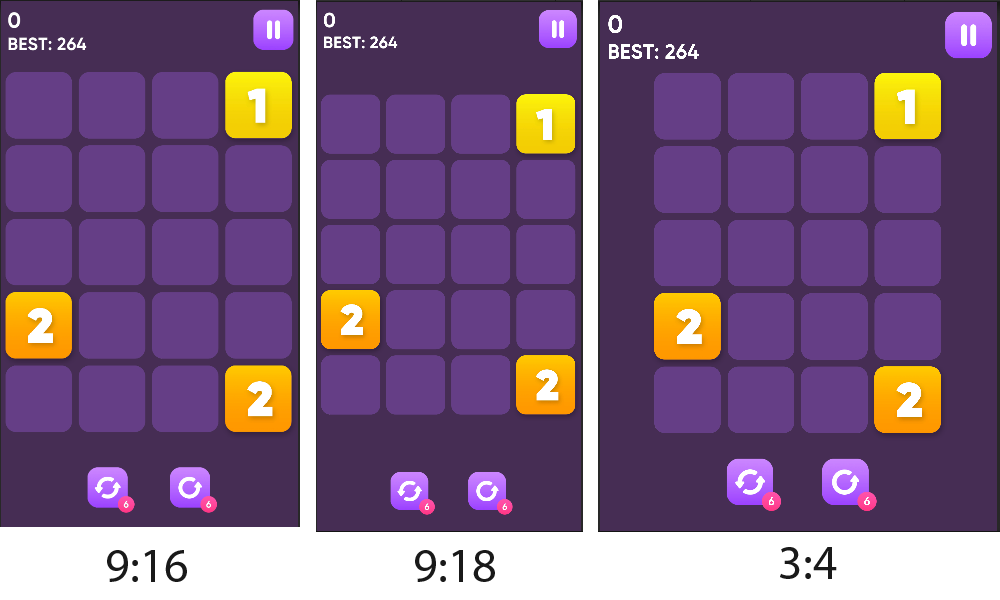

# SAB-Games-Utils
Полезные утилиты для Unity разработчика
## Оглавление
- [CameraFitter](#CameraFitter)
- [MultiButton](#MultiButton)
- [SafeAreaPanel](#SafeAreaPanel)
- [TapUtils](#TapUtils)
## CameraFitter
Используется для автоматического изменения размера камеры (сохраняет видимое пространство камеры по ширине)

### Camera Fit Type
Привязывает камеру к верху, центру или низу
- **Top**
- **Center**
- **Bottom**

### Aspect Fit Type
Ограничивает автоматическое изменение размера камеры для разных разрешений
- **Only Wide** (только для экранов шире чем 16:9)
- **Only Not Wide** (только для экранов уже чем 4:3)
- **Both** (для всех экранов)
Пример для **Only Wide**

### Default Aspect
Значение с которым вы работаете в редакторе Unity. Например, в редакторе вы настроили размер камеры под разрешение 1920:1080, соответственно значение нужно выставить в 1920/1080(1,77777)
