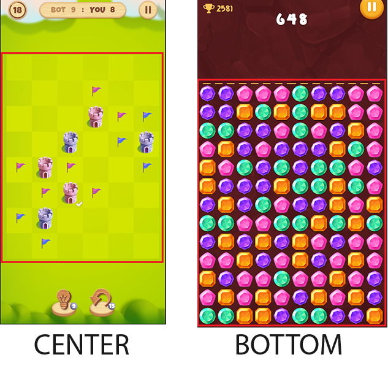

# SAB-Games-Utils
Полезные утилиты для Unity разработчика
## Оглавление
- [CameraFitter](#CameraFitter)
- [MultiButton](#MultiButton)
- [SafeAreaPanel](#SafeAreaPanel)
- [TapUtils](#TapUtils)
## CameraFitter
Используется для автоматического изменения размера камеры (сохраняет видимое пространство камеры по ширине)

### Camera Fit Type
- Top
- Center

- Bottom

